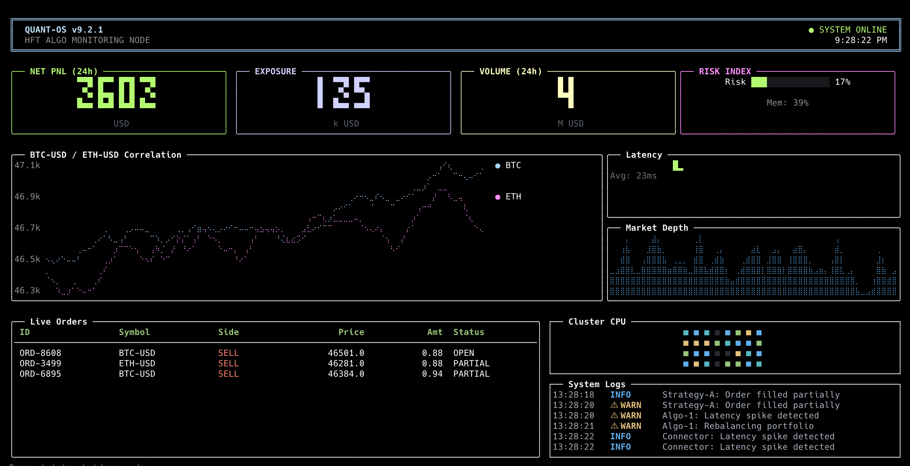
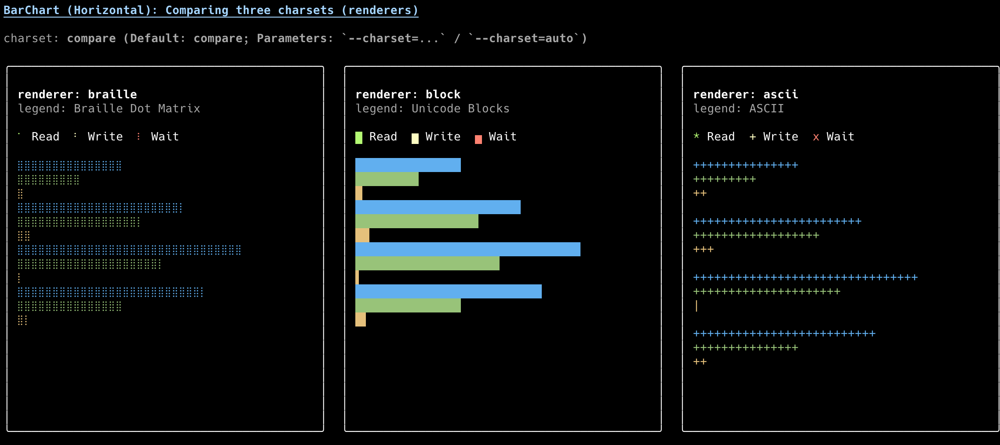

# ink-hud

> 💎 Retina-grade terminal data visualization dashboard - High-resolution chart library based on Braille characters

[](https://www.npmjs.com/package/ink-hud)
[](https://opensource.org/licenses/MIT)

**ink-hud** is a high-fidelity data visualization component library designed for the terminal, built on React and Ink. By utilizing Braille dot matrix characters (⣿), it achieves 8x higher vertical resolution than standard block characters, delivering smooth and detailed charts and data visualizations right in your terminal.



## ✨ Core Features

- **🎯 High-Resolution Rendering**: Uses Braille dot matrix characters (2×4 dots) for 8x vertical resolution
- **🎨 Multi-Renderer Architecture**: Auto-detects terminal capabilities, supports Braille, Block, and ASCII rendering modes
- **📊 Rich Component Library**: 13+ ready-to-use components covering charts, metrics, and layouts
- **🎭 VS Code Dark+ Theme**: Carefully designed default color scheme, beautiful and readable
- **📐 Responsive Layout**: Built-in Grid and Panel system for easy adaptive terminal interfaces
- **⚡ Smooth Animations**: Built-in data smoothing Hooks with multiple easing functions
- **🔧 TypeScript First**: Complete type definitions for excellent developer experience
- **🌈 Compatibility Guaranteed**: Auto-degrades to block characters or ASCII for universal terminal support

## 📦 Installation

```bash
npm install ink-hud ink react
# or with pnpm
pnpm add ink-hud ink react
```

**Requirements:**
- Node.js >= 18.0.0
- React >= 18.0.0
- Ink >= 4.0.0

## 🚀 Quick Start

```tsx
import React from 'react';
import { render } from 'ink';
import { LineChart } from 'ink-hud';

const App = () => {
    const data = [
        { name: 'CPU', data: [12, 15, 45, 32, 60, 75, 20, 10], color: 'cyan' },
        { name: 'Memory', data: [40, 42, 45, 48, 40, 38, 42, 45], color: 'magenta' },
    ];

    return <LineChart series={data} width={60} height={15} />;
};

render(<App />);
```

```bash
npx tsx app.tsx
```

## 📊 Components

### Chart Components

#### LineChart
Multi-series line chart for trend analysis and time series comparison.


```tsx
<LineChart 
    series={[{ name: 'CPU', data: [12, 15, 45, 32], color: 'cyan' }]} 
    width={60} 
    height={15}
    showLegend={true}
/>
```

#### AreaChart
Stacked area chart for cumulative data and proportion trends.


```tsx
<AreaChart 
    series={[{ name: 'Usage', data: [10, 20, 15, 25], color: 'green' }]} 
    width={60} 
    height={15}
/>
```

#### BarChart
Vertical and horizontal bar charts for category comparison.




```tsx
<BarChart 
    series={[{ name: 'Sales', data: [100, 200, 150], color: 'blue' }]} 
    width={40} 
    height={15}
    orientation="vertical"
/>
```

#### PieChart
Pie chart for distribution and resource allocation visualization.


```tsx
<PieChart 
    data={[
        { name: 'System', value: 30, color: 'cyan' },
        { name: 'Apps', value: 50, color: 'green' },
        { name: 'Free', value: 20, color: 'yellow' },
    ]} 
    width={30} 
    height={15}
/>
```

#### Sparkline
Compact inline trend chart for embedded metrics.


```tsx
<Sparkline data={[1, 4, 2, 5, 3, 6]} width={20} color="cyan" />
```

#### Heatmap
2D grid visualization for matrix data and density distribution.


```tsx
<Heatmap 
    data={[[0.2, 0.5, 0.8], [0.1, 0.4, 0.7], [0.3, 0.6, 0.9]]} 
/>
```

### Metric Components

#### BigNumber
Large number card for KPI display with trend indicators.


```tsx
<BigNumber value={125000} label="Revenue" trend={12.5} color="green" />
```

#### Gauge
Circular or linear progress indicator for percentages and load.


```tsx
<Gauge value={75} label="CPU" max={100} color="yellow" />
```

### Data Components

#### Table
Interactive sortable data table with keyboard navigation.


```tsx
<Table 
    data={[{ id: 1, name: 'Alice' }, { id: 2, name: 'Bob' }]}
    columns={[
        { header: 'ID', accessor: 'id' },
        { header: 'Name', accessor: 'name' },
    ]}
    zebra={true}
/>
```

#### LogStream
Real-time scrolling log display with syntax highlighting.


```tsx
<LogStream 
    logs={['[INFO] Started', '[WARN] High CPU', '[ERROR] Failed']}
    maxLines={10}
/>
```

### Layout Components

#### Panel
Bordered container with optional title for content grouping.


```tsx
<Panel title="System Status" borderColor="cyan">
    <Text>Content here</Text>
</Panel>
```

#### Grid
Responsive grid layout system for dashboard construction.


```tsx
<Grid columns={3} width={120} rowHeight={10}>
    <GridItem><Panel title="A">Content</Panel></GridItem>
    <GridItem span={2}><Panel title="B">Wide</Panel></GridItem>
</Grid>
```

## 🎨 Renderer System

ink-hud auto-detects terminal capabilities and selects the best renderer:

| Renderer | Resolution | Characters | Best For |
|----------|------------|------------|----------|
| **Braille** | 2×4 dots, 8x vertical | `⠀⠁⠂...⣿` | Modern terminals |
| **Block** | 2×8 dots, 8x vertical | `▁▂▃▄▅▆▇█` | UTF-8 terminals |
| **ASCII** | 1×3, max compat | `_.-'"` | Legacy terminals |

```tsx
// Force specific renderer
<LineChart series={data} renderer="braille" />
<LineChart series={data} renderer="block" />
<LineChart series={data} renderer="ascii" />
```

## 🖥 Terminal Compatibility

| Support Level | Terminals |
|---------------|-----------|
| ✅ **Full (Braille)** | iTerm2, Warp, Alacritty, Kitty, Windows Terminal, VS Code |
| ⚠️ **Partial (Block)** | macOS Terminal.app, some SSH sessions |
| 📝 **Minimum (ASCII)** | Legacy terminals, plain text environments |

## 📚 Examples

```bash
git clone https://github.com/zzf2333/ink-hud.git
cd ink-hud
pnpm install

# Run complete dashboard
npx tsx examples/dashboard.tsx

# Run individual components
npx tsx examples/basic/linechart.tsx
npx tsx examples/basic/piechart.tsx
npx tsx examples/basic/table.tsx
```

## 🛠 Development

```bash
pnpm install    # Install dependencies
pnpm build      # Build library
pnpm test       # Run tests
pnpm lint       # Lint code
pnpm typecheck  # Type check
```

## 📖 Documentation

- [Component API Reference](./docs/api.md)
- [Component Usage Guide](./docs/components.md)
- [Getting Started Tutorial](./docs/getting-started.md)

## 🤝 Contributing

Contributions welcome! See [CONTRIBUTING.md](./CONTRIBUTING.md) for details.

## 📄 License

MIT © [saonian](https://github.com/zzf2333)

---

**If this project helps you, please give it a ⭐️!**
