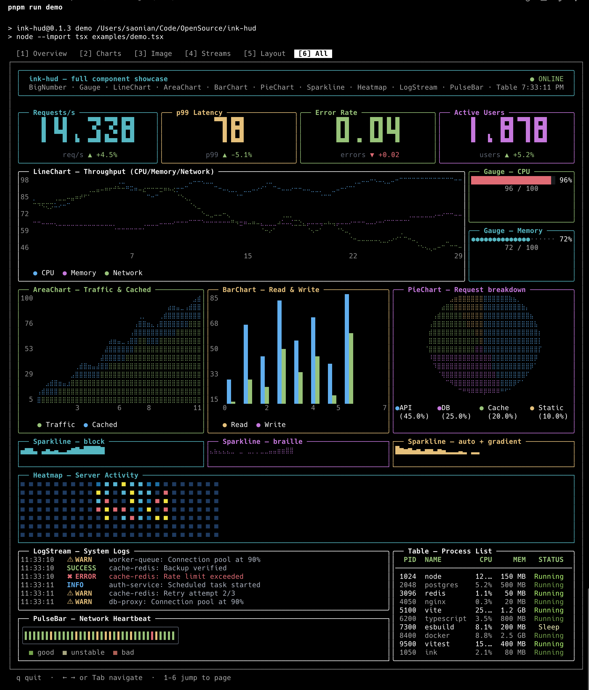
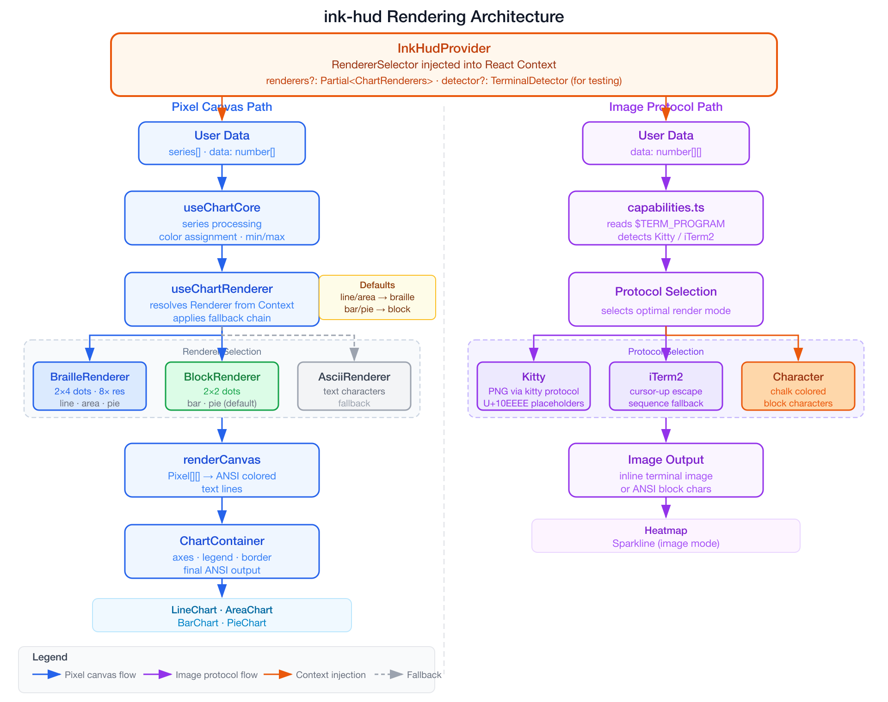

<div align="center">

<h1>ink-hud</h1>

<p><strong>Retina-grade data visualization for the terminal — built on React and Ink.</strong></p>

<p>
  <a href="https://github.com/zzf2333/ink-hud/stargazers"></a>
  <a href="https://www.npmjs.com/package/ink-hud"></a>
  <a href="LICENSE"></a>
  
  
</p>

</div>

---

ink-hud renders 13+ chart and layout components directly in the terminal. It uses Braille dot-matrix characters (⣿) to achieve 8× higher vertical resolution than standard block characters, and falls back gracefully to block or ASCII mode on terminals that don't support Braille.



---

## Components

**Charts** — LineChart · AreaChart · BarChart · PieChart · Sparkline · Heatmap

**Metrics** — BigNumber · Gauge

**Data** — Table · LogStream · PulseBar

**Layout** — Panel · Grid

---

## Installation

```bash
npm install ink-hud ink react
# or
pnpm add ink-hud ink react
```

Requires Node.js 18+, React 18+, Ink 4+.

---

## Quick Start

```tsx
import React from 'react';
import { render } from 'ink';
import { InkHudProvider, LineChart } from 'ink-hud';

const App = () => {
    const data = [
        { name: 'CPU',    data: [12, 15, 45, 32, 60, 75, 20, 10], color: 'cyan' },
        { name: 'Memory', data: [40, 42, 45, 48, 40, 38, 42, 45], color: 'magenta' },
    ];

    return (
        <InkHudProvider>
            <LineChart series={data} width={60} height={15} showLegend />
        </InkHudProvider>
    );
};

render(<App />);
```

```bash
npx tsx app.tsx
```

---

## Component Reference

### LineChart

Multi-series line chart for trend analysis and time-series comparison.

```tsx
<LineChart
    series={[{ name: 'CPU', data: [12, 15, 45, 32], color: 'cyan' }]}
    width={60}
    height={15}
    showLegend
/>
```

### AreaChart

Filled area chart for cumulative data and proportion trends.

```tsx
<AreaChart
    series={[{ name: 'Traffic', data: [10, 20, 15, 25], color: 'green' }]}
    width={60}
    height={15}
/>
```

### BarChart

Vertical bar chart for category comparison. Uses BlockRenderer by default for clean rectangular fills.

```tsx
<BarChart
    series={[{ name: 'Requests', data: [100, 200, 150, 180], color: 'blue' }]}
    width={40}
    height={15}
    orientation="vertical"
/>
```

### PieChart

Circular sector chart for distribution and resource allocation. The canvas is constrained to a visual square so the circle always fills the container.

```tsx
<PieChart
    data={[
        { name: 'API',    value: 45, color: 'cyan' },
        { name: 'DB',     value: 25, color: 'blue' },
        { name: 'Cache',  value: 20, color: 'green' },
        { name: 'Static', value: 10, color: 'yellow' },
    ]}
    width={30}
    height={15}
/>
```

### Sparkline

Compact inline trend chart for embedded metrics. Uses a static character table (`SPARK_LEVELS`) — its `variant` prop (`'block' | 'braille'`) is independent of `InkHudProvider renderers`. Supports an `image` mode that renders via the Kitty/iTerm2 image protocol when available.

```tsx
<Sparkline data={[1, 4, 2, 5, 3, 6]} width={20} color="cyan" />
<Sparkline data={[1, 4, 2, 5, 3, 6]} width={20} mode="auto" colors={['#00ff00', '#ff0000']} />
```

### Heatmap

2D grid visualization for matrix data and density distribution. Uses the Kitty or iTerm2 image protocol for pixel-perfect rendering when available; falls back to `mode="character"` (chalk-colored block characters) on other terminals.

```tsx
<Heatmap
    data={[[0.2, 0.5, 0.8], [0.1, 0.4, 0.7], [0.3, 0.6, 0.9]]}
/>
```

### BigNumber

Large-number KPI card with trend indicator.

```tsx
<BigNumber value={14328} label="Requests/s" trend={4.5} color="cyan" />
```

### Gauge

Progress bar for percentages and load metrics.

```tsx
<Gauge value={96} max={100} label="CPU" color="yellow" />
```

### Table

Sortable data table with keyboard navigation and optional zebra striping.

```tsx
<Table
    data={[
        { pid: 1704, name: 'node',     cpu: '12%', mem: '150 MB', status: 'Running' },
        { pid: 2048, name: 'postgres', cpu: '5.2%', mem: '100 MB', status: 'Running' },
    ]}
    columns={[
        { header: 'PID',    accessor: 'pid' },
        { header: 'NAME',   accessor: 'name' },
        { header: 'CPU',    accessor: 'cpu' },
        { header: 'MEM',    accessor: 'mem' },
        { header: 'STATUS', accessor: 'status' },
    ]}
    zebra
/>
```

### LogStream

Real-time scrolling log display with per-level color coding.

```tsx
<LogStream
    logs={['[INFO] Started', '[WARN] High CPU', '[ERROR] Connection failed']}
    maxLines={10}
/>
```

### PulseBar

Heartbeat-style connection status history.

```tsx
<PulseBar
    records={[{ status: 'good' }, { status: 'unstable' }, { status: 'bad' }]}
    maxBars={30}
    variant="unicode"
/>
```

### Panel

Bordered container with an optional title for content grouping.

```tsx
<Panel title="System Status" borderColor="cyan">
    <Text>Content here</Text>
</Panel>
```

### Grid

Responsive grid layout system. Children are `<GridItem>` elements that can span multiple columns.

```tsx
<Grid columns={3} width={120} rowHeight={10}>
    <GridItem><Panel title="A">Content</Panel></GridItem>
    <GridItem span={2}><Panel title="B">Wide content</Panel></GridItem>
</Grid>
```

---

## Renderer System

ink-hud uses two independent rendering systems:



### Pixel Canvas (charts)

LineChart, AreaChart, BarChart, and PieChart share a five-stage pipeline:

1. `useChartCore` — process series data, compute min/max, assign colors
2. `useChartRenderer` — resolve a `Renderer` instance from the `InkHudProvider` context
3. `renderXxxChartCanvas` — draw to a `Pixel[][]` grid via `renderer.setPixel()` / `drawLine()`
4. `renderer.renderCanvas()` — convert `Pixel[][]` to ANSI-colored text lines
5. `ChartContainer` — wrap with axes, legend, and border

Each chart ships with a pre-tuned default renderer:

| Chart kind | Default renderer | Reason |
|------------|-----------------|--------|
| `line` | Braille | 2×4 sub-pixel grid renders smooth diagonals |
| `area` | Braille | Fine-grained fill under curves |
| `bar` | Block | Clean rectangular bar edges |
| `pie` | Block | Solid fills create clean sector boundaries |

The three renderer implementations:

| Renderer | Characters | Resolution |
|----------|-----------|-----------|
| `BrailleRenderer` | `⠀⠁⠂…⣿` | 2×4 dots per cell |
| `BlockRenderer` | `▁▂▃▄▅▆▇█` | 2×2 dots per cell |
| `AsciiRenderer` | ASCII text | 1×1 per cell (fallback) |

### Image Protocol (Heatmap, Sparkline image mode)

`capabilities.ts` detects terminal support from environment variables (`$TERM_PROGRAM`, `$TERM`). For Kitty terminals, components upload a PNG via `encodeKittyUpload()` and render `U+10EEEE` Unicode Placeholder characters — this survives Ink re-renders without cursor flicker. For iTerm2, a cursor-up escape sequence fallback is used. On other terminals, `mode="character"` renders chalk-colored block characters.

---

## Configuration

### InkHudProvider

Wrap your app in `<InkHudProvider>` to enable renderer selection and dependency injection. Without the provider, components use the global `TerminalDetector` singleton.

```tsx
// Auto-detect terminal, use default renderer per chart kind
<InkHudProvider>
    <MyApp />
</InkHudProvider>

// Override renderer for specific chart kinds
<InkHudProvider renderers={{ line: 'block', bar: 'braille' }}>
    <MyApp />
</InkHudProvider>

// Inject a mock detector for testing (no env-var manipulation needed)
<InkHudProvider detector={mockDetector}>
    <MyApp />
</InkHudProvider>
```

When the configured renderer is not supported by the terminal (e.g. Braille on a legacy console), `BlockRenderer` is used as a fallback. In development mode, a one-time `console.warn` is emitted per affected chart kind to help diagnose why the configured renderer is not active.

### Smooth animations

```tsx
import { useSmooth, useSmoothArray } from 'ink-hud';

// Animate a single number
const smoothValue = useSmooth(rawValue, { duration: 300, easing: 'easeOutCubic' });

// Animate a data series
const smoothSeries = useSmoothArray(rawSeries, { duration: 400 });
```

### Theme

```tsx
import { ThemeProvider, ONE_DARK_THEME } from 'ink-hud';

<ThemeProvider theme={ONE_DARK_THEME}>
    <MyApp />
</ThemeProvider>
```

---

## Terminal Compatibility

| Support level | Terminals |
|--------------|-----------|
| Full (Braille + image protocol) | iTerm2, Warp, Alacritty, Kitty, Windows Terminal, VS Code |
| Partial (Block only) | macOS Terminal.app, some SSH sessions |
| Minimum (ASCII fallback) | Any ANSI-capable terminal |

---

## Examples

Run the full dashboard:

```bash
git clone https://github.com/zzf2333/ink-hud.git
cd ink-hud
pnpm install
pnpm demo
```

The `examples/` directory also contains individual page demos:

```bash
node --import tsx examples/pages/charts.tsx
node --import tsx examples/pages/streams.tsx
node --import tsx examples/pages/layout.tsx
node --import tsx examples/pages/image.tsx
```

---

## Development

```bash
pnpm install    # install dependencies
pnpm build      # build (ESM + CJS + declarations)
pnpm test       # run test suite
pnpm typecheck  # tsc --noEmit
pnpm lint       # biome check
pnpm demo       # run examples/demo.tsx
```

Tests use `ink-testing-library`. The standard pattern for controlling renderer selection in tests:

```tsx
// Inject a mock detector — no env-var manipulation required
const detector = new TerminalDetector({ TERM_PROGRAM: 'iTerm.app' });

render(
    <InkHudProvider detector={detector}>
        <LineChart series={data} width={40} height={10} />
    </InkHudProvider>
);
```

Or bypass detection entirely with `forceRenderer`:

```tsx
<LineChart series={data} width={40} height={10} forceRenderer="block" />
```

---

## Contributing

Contributions are welcome. See [CONTRIBUTING.md](./CONTRIBUTING.md) for details.

---

## License

MIT © [saonian](https://github.com/zzf2333)
