# Component Usage Guide

This guide provides detailed usage instructions for all ink-hud components.

## Chart Components

### LineChart

Multi-series line chart for trend visualization.

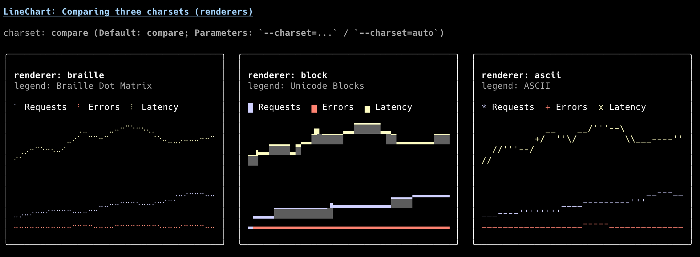

#### Props

| Prop | Type | Default | Description |
|------|------|---------|-------------|
| `series` | `SeriesData[]` | required | Array of data series |
| `width` | `number` | `60` | Chart width in characters |
| `height` | `number` | `15` | Chart height in characters |
| `showXAxis` | `boolean` | `true` | Show X axis |
| `showYAxis` | `boolean` | `true` | Show Y axis |
| `showLegend` | `boolean` | `true` | Show legend |
| `renderer` | `RendererType` | `auto` | Renderer type |

#### Example

```tsx
import { LineChart } from 'ink-hud';

const series = [
    { name: 'CPU', data: [12, 15, 45, 32, 60, 75], color: 'cyan' },
    { name: 'Memory', data: [40, 42, 45, 48, 40, 38], color: 'magenta' },
];

<LineChart series={series} width={60} height={15} showLegend={true} />
```

---

### AreaChart

Stacked area chart with gradient fills.

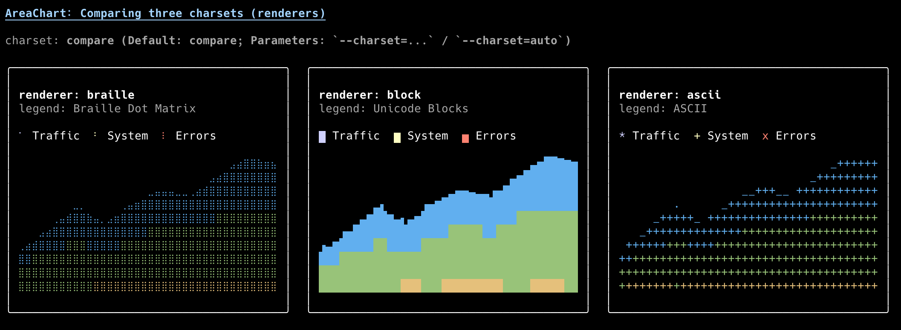

#### Props

Same as LineChart, plus:

| Prop | Type | Default | Description |
|------|------|---------|-------------|
| `stacked` | `boolean` | `false` | Stack series areas |
| `fillOpacity` | `number` | `0.5` | Area fill opacity |

#### Example

```tsx
import { AreaChart } from 'ink-hud';

<AreaChart 
    series={[{ name: 'Usage', data: [10, 20, 15, 25, 30], color: 'green' }]}
    width={60}
    height={15}
/>
```

---

### BarChart

Vertical or horizontal bar chart.

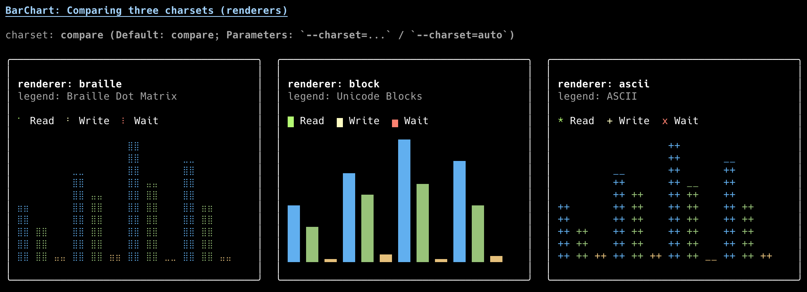

#### Props

| Prop | Type | Default | Description |
|------|------|---------|-------------|
| `series` | `SeriesData[]` | required | Data series |
| `orientation` | `'vertical' \| 'horizontal'` | `'vertical'` | Bar orientation |
| `gap` | `number` | `1` | Gap between bars |
| `showValues` | `boolean` | `false` | Show value labels |

#### Example

```tsx
import { BarChart } from 'ink-hud';

<BarChart 
    series={[{ name: 'Sales', data: [100, 200, 150, 300], color: 'blue' }]}
    width={40}
    height={15}
    orientation="vertical"
/>
```

---

### PieChart

Pie/donut chart for distribution visualization.

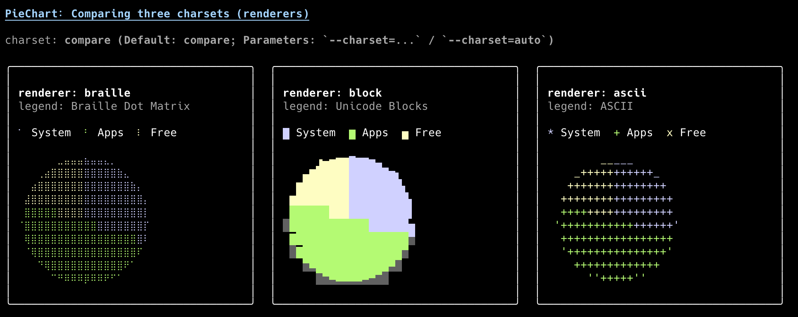

#### Props

| Prop | Type | Default | Description |
|------|------|---------|-------------|
| `data` | `PieData[]` | required | Pie segments |
| `width` | `number` | `30` | Chart width |
| `height` | `number` | `15` | Chart height |
| `showLegend` | `boolean` | `true` | Show legend |
| `legendPosition` | `'right' \| 'bottom'` | `'right'` | Legend position |

#### Example

```tsx
import { PieChart } from 'ink-hud';

<PieChart 
    data={[
        { name: 'System', value: 30, color: 'cyan' },
        { name: 'Apps', value: 50, color: 'green' },
        { name: 'Free', value: 20, color: 'yellow' },
    ]}
    width={30}
    height={15}
/>
```

---

### Sparkline

Compact inline trend indicator.

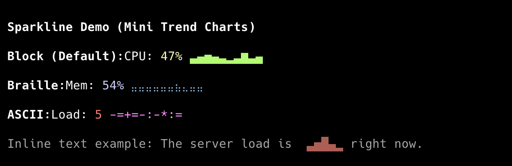

#### Props

| Prop | Type | Default | Description |
|------|------|---------|-------------|
| `data` | `number[]` | required | Data points |
| `width` | `number` | `20` | Width in characters |
| `color` | `string` | `'cyan'` | Line color |

#### Example

```tsx
import { Sparkline } from 'ink-hud';

<Sparkline data={[1, 4, 2, 5, 3, 6, 4, 7]} width={20} color="green" />
```

---

### Heatmap

2D grid visualization with color gradients.


#### Props

| Prop | Type | Default | Description |
|------|------|---------|-------------|
| `data` | `number[][]` | required | 2D data matrix |
| `variant` | `'unicode' \| 'ascii'` | `'unicode'` | Character set |
| `colorScale` | `string[]` | VS Code palette | Color gradient |

#### Example

```tsx
import { Heatmap } from 'ink-hud';

<Heatmap 
    data={[
        [0.2, 0.5, 0.8],
        [0.1, 0.4, 0.7],
        [0.3, 0.6, 0.9],
    ]}
/>
```

---

## Metric Components

### BigNumber

Large KPI display card with trend indicator.

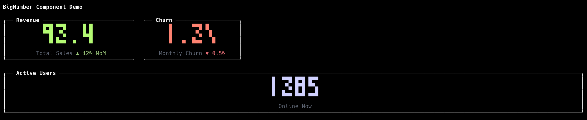

#### Props

| Prop | Type | Default | Description |
|------|------|---------|-------------|
| `value` | `number` | required | Display value |
| `label` | `string` | - | Label text |
| `trend` | `number` | - | Trend percentage |
| `color` | `string` | `'white'` | Value color |
| `decimals` | `number` | `0` | Decimal places |

#### Example

```tsx
import { BigNumber } from 'ink-hud';

<BigNumber value={125000} label="Revenue" trend={12.5} color="green" />
```

---

### Gauge

Circular or linear progress indicator.

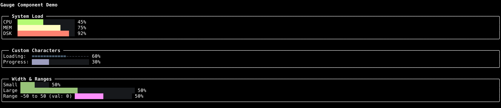

#### Props

| Prop | Type | Default | Description |
|------|------|---------|-------------|
| `value` | `number` | required | Current value |
| `max` | `number` | `100` | Maximum value |
| `label` | `string` | - | Label text |
| `color` | `string` | `'cyan'` | Gauge color |
| `showPercentage` | `boolean` | `true` | Show percentage |

#### Example

```tsx
import { Gauge } from 'ink-hud';

<Gauge value={75} max={100} label="CPU Load" color="yellow" />
```

---

## Data Components

### Table

Interactive data table with sorting and keyboard navigation.

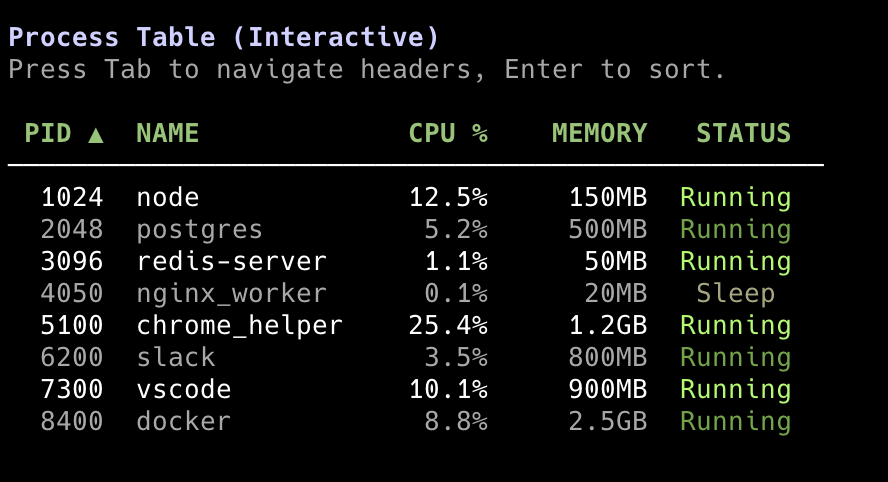

#### Props

| Prop | Type | Default | Description |
|------|------|---------|-------------|
| `data` | `T[]` | required | Data array |
| `columns` | `TableColumn<T>[]` | required | Column definitions |
| `zebra` | `boolean` | `false` | Alternating row colors |
| `onSort` | `(column, index) => void` | - | Sort callback |

#### Example

```tsx
import { Table } from 'ink-hud';

<Table 
    data={[
        { id: 1, name: 'Alice', cpu: 12.5 },
        { id: 2, name: 'Bob', cpu: 8.3 },
    ]}
    columns={[
        { header: 'ID', accessor: 'id' },
        { header: 'Name', accessor: 'name' },
        { header: 'CPU', accessor: (row) => `${row.cpu}%` },
    ]}
    zebra={true}
/>
```

---

### LogStream

Real-time scrolling log display.

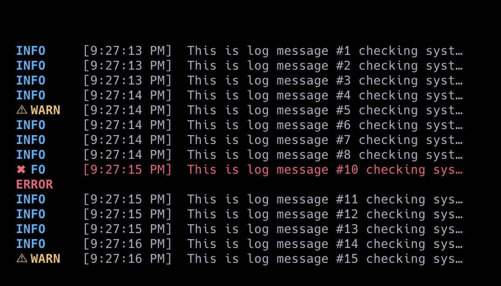

#### Props

| Prop | Type | Default | Description |
|------|------|---------|-------------|
| `logs` | `string[]` | required | Log messages |
| `maxLines` | `number` | `10` | Max visible lines |
| `highlightPatterns` | `HighlightPattern[]` | default patterns | Syntax highlighting |

#### Example

```tsx
import { LogStream } from 'ink-hud';

<LogStream 
    logs={[
        '[INFO] Application started',
        '[WARN] High memory usage',
        '[ERROR] Connection failed',
    ]}
    maxLines={5}
/>
```

---

### PulseBar

Heartbeat-style connection status history.

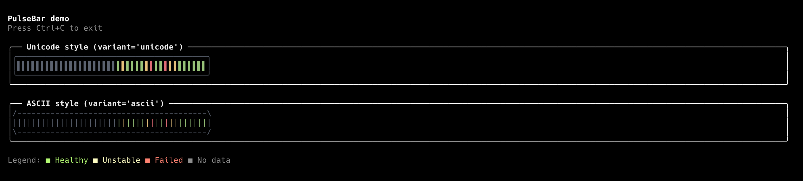

#### Props

| Prop | Type | Default | Description |
|------|------|---------|-------------|
| `records` | `PingRecord[]` | required | Ping history entries |
| `maxBars` | `number` | `30` | Maximum number of bars to display |
| `variant` | `'unicode' \| 'ascii'` | `'unicode'` | Character style |
| `colors` | `{ good?: string; unstable?: string; bad?: string }` | - | Custom status colors |

#### Example

```tsx
import { PulseBar } from 'ink-hud';

<PulseBar
    records={[
        { status: 'good' },
        { status: 'unstable' },
        { status: 'bad' },
    ]}
    maxBars={30}
    variant="unicode"
/>
```

---

## Layout Components

### Panel

Bordered container with title.

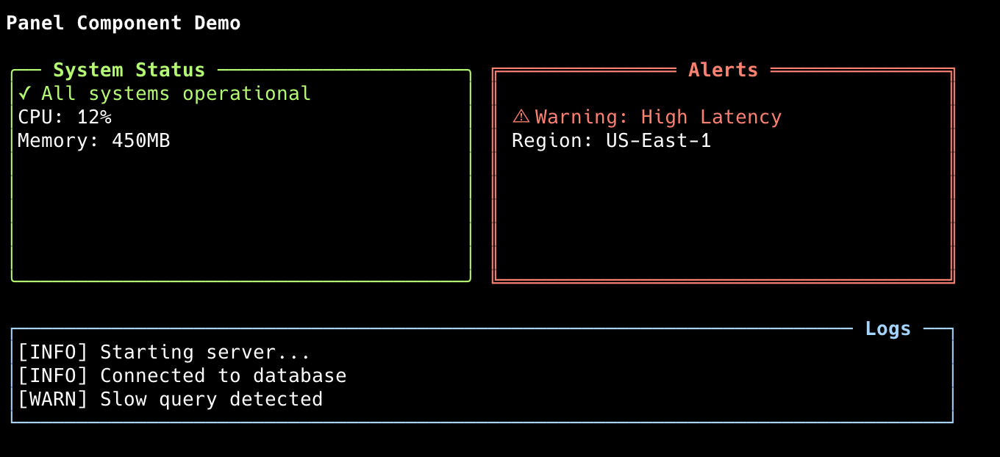

#### Props

| Prop | Type | Default | Description |
|------|------|---------|-------------|
| `title` | `string` | - | Panel title |
| `borderColor` | `string` | `'gray'` | Border color |
| `padding` | `number` | `1` | Inner padding |

#### Example

```tsx
import { Panel } from 'ink-hud';

<Panel title="System Status" borderColor="cyan">
    <Text>All systems operational</Text>
</Panel>
```

---

### Grid / GridItem

Responsive grid layout system.

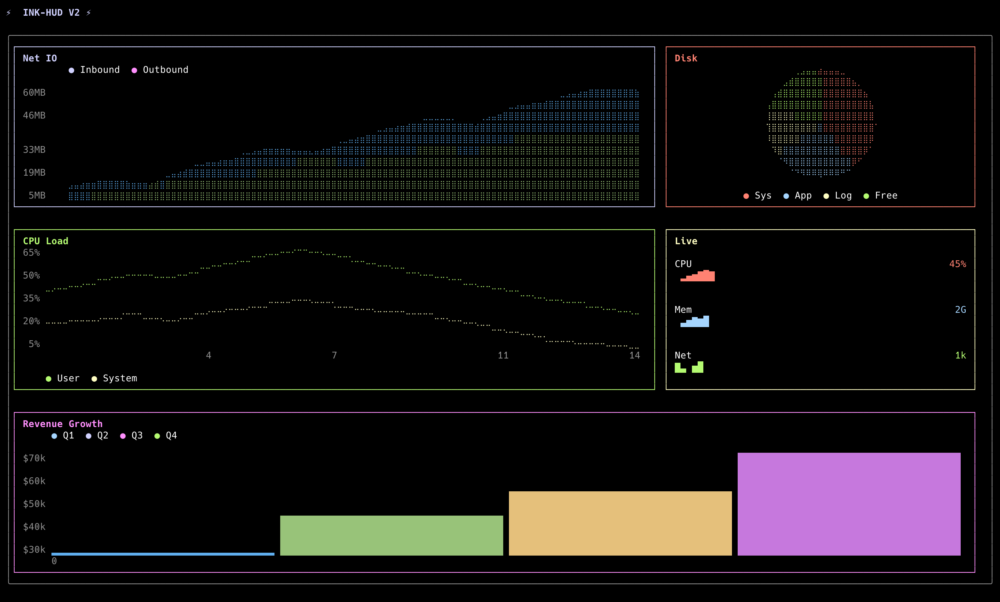

#### Grid Props

| Prop | Type | Default | Description |
|------|------|---------|-------------|
| `columns` | `number` | `3` | Number of columns |
| `width` | `number` | terminal width | Total width |
| `rowHeight` | `number` | `10` | Row height |
| `gap` | `number` | `1` | Gap between cells |

#### GridItem Props

| Prop | Type | Default | Description |
|------|------|---------|-------------|
| `span` | `number` | `1` | Column span |
| `rowSpan` | `number` | `1` | Row span |

#### Example

```tsx
import { Grid, GridItem, Panel } from 'ink-hud';

<Grid columns={3} width={120} rowHeight={10}>
    <GridItem>
        <Panel title="A">Content A</Panel>
    </GridItem>
    <GridItem span={2}>
        <Panel title="B (wide)">Content B</Panel>
    </GridItem>
    <GridItem>
        <Panel title="C">Content C</Panel>
    </GridItem>
</Grid>
```

---

## Utility Components

### Legend

Chart legend for color mapping.

#### Props

| Prop | Type | Default | Description |
|------|------|---------|-------------|
| `items` | `LegendItem[]` | required | Legend entries |
| `layout` | `'horizontal' \| 'vertical'` | `'horizontal'` | Layout direction |

#### Example

```tsx
import { Legend } from 'ink-hud';

<Legend 
    items={[
        { name: 'CPU', color: 'cyan', symbol: '●' },
        { name: 'Memory', color: 'magenta', symbol: '●' },
    ]}
    layout="horizontal"
/>
```
